<h1 align="center">Vital Extraction Challenge</h1>

<h2>Abstract</h2>
<p>This Repository Contains our <b>Silver medal solution</b> to address the problem statement proposed by Cloudphysician in <b>InterIIT Techmeet 11.0</b>. Cloudphysician is a company that focuses on AI integration in the Healthcare system. In hospital the monitor shows vital informations about the patient. To integrate AI with the system we need to get the informations about the vitals from the monitor. In our approach we have processed the monitor images to extract the vital informations. We have used semi-supervised segmentation technique for extracting the monitor from complete image and then transformed the extracted monitor in birds-eye perspective. Finally we used <b>YOLOv5-nano</b> for vital extractions from monitor and <b>Paddle-OCR</b> as an open-source character recognition tool. For increasing the vital extraction accuracy, we used some monitor layout knowledge for post-processing the predicted results. <b>Our complete pipeline takes about 0.6-1.0 second for inference on CPU.</b>
</p>

<p>
    <b>Along with the vital extraction, our pipeline is able to extract HR-Graph and able to digitize it with a good accuracy. From Visualisation point of view we provided a frontend built using gradio for viewing the results effectively.</b>
</p>

Below is a figure depicting our pipleine from a higher level

<!-- Figure here -->
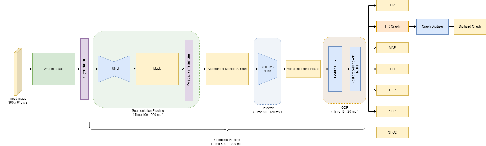


<h2 align="center">Pipeline Components with Training and Inference Settings </h2>

<h3> 1. MONITOR SEGMENTATION </h3>

<h4>- Approach</h4>

Our first task is to extract the monitor from a complete image, we have used segmentation based UNET architecture as our backbone and initialized it with IMAGENET weights. Choice of using Segmentation is due to the fact that the monitors' positions are not always rectangular so detection will not work that good instead pixel level segmentation will work better. **We had 7000 unlabelled data, so we decided to combine it with 2000 labelled data and use a Semi-Supervised(SS) Semantic Segmentation Approach(Inspired from this paper [LINK](https://arxiv.org/pdf/1904.12848.pdf))**, their work was based on Image classification, we have modified their working for semantic segmentation of our case. Additionally, our novel additions like LR scheduler, augmentations variations(randAugment -  a type of novel augmentation technique - [LINK](https://medium.datadriveninvestor.com/why-randaugment-is-the-best-data-augmentation-approach-4a48f22b2152)) boost the quality of segmentation mask compared to supervised approach as it is able to generalize well on cross-domain data.

Below are some images which show the better mask generation of Semi-Supervised Approach in most scenarios where Supervised alone method is not working well.

<!-- Figures of Comparison-->
<p align="center">
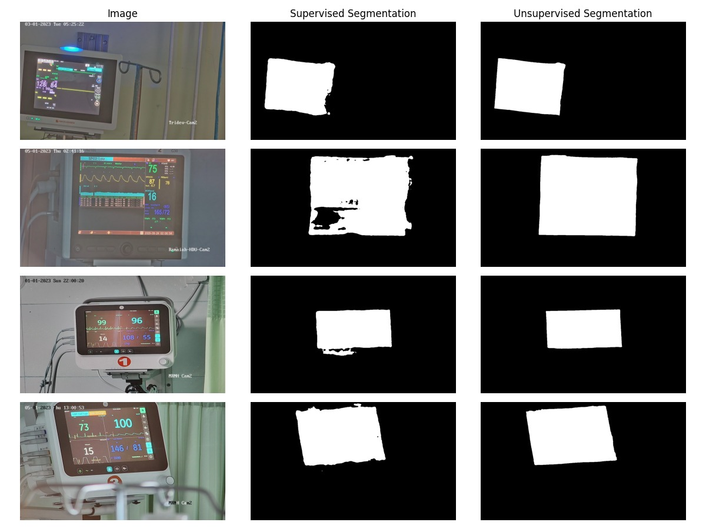
</p>


<h4>- Training Setup</h4>
In this section, we will present the training setup and parameters for our Semi-Supervised Segmentation.

We used a loss function as,  

$L = L_{s} + \lambda L_{u}$ 

whre **$\lambda$** is a hyperparameter adjusting both losses, $L_{s}$ is binary cross entropy supervised loss and $L_{u}$ is unsupervised consistency loss, we used KL divergence as a consistency loss, it helps in matching the mask similarity.


*HYPERPARAMETERS:-*

```
LEARNING_RATE = 3e-5
BATCH_SIZE = 6
UNSUP_BATCH_SIZE = 16
NUM_EPOCHS = 25
IMAGE_HEIGHT = 320
IMAGE_WIDTH = 640
LAMBDA = 0.3
DECAY_FACTOR = 0.9
```
It is recommended to use a bigger batch size for unsupervised image compared to supervised, we have used a low learning rate to allow model to converge slowly keeping info of IMAGENET params, used loss factor lambda as 0.3, and learning rate decay factor as 0.3. We used image shape as almost half compared of the original size for segmentation. We have done this and then upsampled the mask to original size because the monitor has a nice geometrical shape which allow easy resizing of mask.
We have saved the model based on mIOU (mean Intersection over union score) on validation. We have set 1800 labelled data to train set and 200 labelled data to validation set.

Plot for loss and mIOU score is below:- 
<!-- UDA UNET miou figure -->
<p align="center">
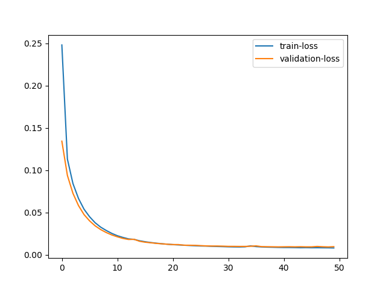

</p>


<h4>- Inference Setup</h4>
Inference section is provided in the notebook itself, we just have to perform preprocessing of normalization and then take the inference on cpu. It takes rougly 0.4-0.6 seconds for each inference on cpu.


<h3> 2. PRESPECTIVE TRANSFORMATION</h3>

<h4>- Approach</h4>

After getting the mask we have to extract the monitor using that mask from input image and then aligning the monitor in birds eye view, we used convex hull and contours methods for finding mask corners and then used opencv perspective transform for wrapped perception, and we output the wrapped image in two resolution, one used for ocr and other used for classification. Code for it is present in the notebook itself. It's inference time is between 0.02-0.08 second.

Figure below presents an output from perspective transform

<!-- <Figure> -->
<p align="center">
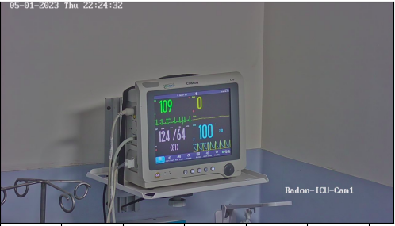
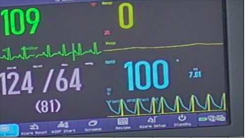</br> <b>Left</b> - Original Image,  <b>Right</b> - Segmented and Perspective transformed image
</p>


<h3> 3. Vitals Detection</h3>

<h4>- Approach</h4>

Now, the next step is to detect the locations of the required vitals (HR, SBP, DBP, MAP, RR, HR_W) from the segmented and perspective corrected monitor. The bounding boxes for the all these vitals were given in the training dataset. Our first baseline approach was to take the union of all the bounding boxes for a particular class, then apply some rules. That was fast but the performance was not very good. So, we decided to use a deep learning model which gives bounding box fast for multiple classes, is fast and can be trained on the given dataset. We tried a few transformer based models like CRAFT, FAST and DeepText-DETR. They gave good bounding boxes but were too slow on GPU.
So, finally to find the bounding boxes, we used **YOLOv5nano**. It is lightweight, has faster inference time and can be trained on our training dataset.

<!-- YOLO models comparison figures -->
Comparison of different YOLOv5 models:
<p align="center">

</p>


<!-- Figures of Comparison-->

<h4>- Training Setup</h4>
In this section, we will present the training setup and parameters for our YOLOv5nano.

We used a loss function as,  

```
Loss = w_o * Loss_o + w_c * Loss_c + w_l * Loss_l + w_s * Loss_s
```

where:

- Loss_o is the objectness loss,
- Loss_c is the classification loss,
- Loss_l is the localization loss,
- Loss_s is the size loss,
- 'w_o', 'w_c', 'w_l', 'w_s' are the weight coefficients that determine the relative importance of each loss.


<!-- <Figure> -->


*HYPERPARAMETERS:-*

```
LEARNING_RATES:
    - 'lr0': (1, 1e-5, 1e-1),  # initial learning rate (SGD=1E-2, Adam=1E-3)
    - 'lrf': (1, 0.01, 1.0),  # final OneCycleLR learning rate (lr0*lrf)
BATCH_SIZE = 16
MOMENTUM : (0.3, 0.6, 0.98),  # SGD momentum/Adam beta1
WEIGHT_DECAY : (1, 0.0, 0.001),  # optimizer weight decay
NUM_EPOCHS = 540
IMAGE_HEIGHT = 320
IMAGE_WIDTH = 640
'box': (1, 0.02, 0.2),  # box loss gain
'cls': (1, 0.2, 4.0),  # cls loss gain
'cls_pw': (1, 0.5, 2.0),  # cls BCELoss positive_weight
'obj': (1, 0.2, 4.0),  # obj loss gain (scale with pixels)
'obj_pw': (1, 0.5, 2.0),  # obj BCELoss positive_weight
'iou_t': (0, 0.1, 0.7),  # IoU training threshold
'anchor_t': (1, 2.0, 8.0),  # anchor-multiple threshold
'anchors': (2, 2.0, 10.0),  # anchors per output grid (0 to ignore)
'fl_gamma': (0, 0.0, 2.0),  # focal loss gamma (efficientDet default gamma=1.5)
```

Training results for yolo is summarised in the following figure

<p align="center">
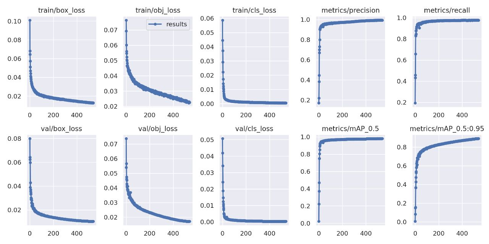
</p>


<h4>- Inference Setup</h4>
Inference section is imported in the notebook itself. Preprocessing and normalization are done by the model itself. It takes rougly 50ms-100ms for each inference on CPU. Below present an example of Yolo-Extracted vitals.

<p align="center">
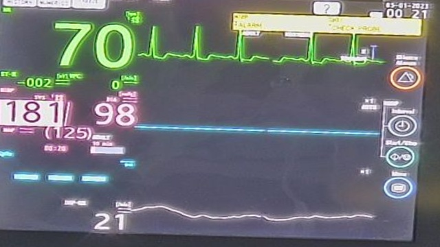
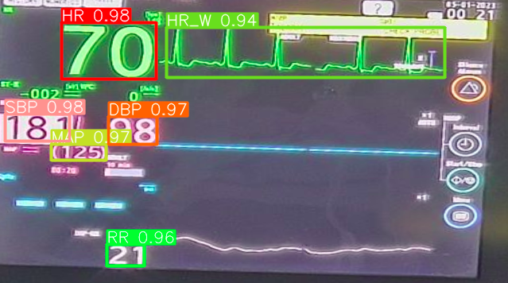</br> 
<b>Left</b> - Perspective Transformed Image,  <b>Right</b> - Yolo Extracted Vitals and Graph
</p>

<h3> 4. OCR</h3>

<h4>- Approach</h4>

We have used Paddle OCR, which is a fast, lightweight and open source detector + OCR model based on CRNN (Convolutional Recurrent Neural Network), we used it's fastest and recent version of PPOCR-v3 and used it for recognition part only as it runs considerably faster on CPU while maintaining a good recognition accuracy.

Inference code for this model is one linear simple and imported in the notebook. It takes roughly 0.4-0.5 seconds for inference of all detected bounding box on CPU. After implementing multithreading on top of it, we took it's inference time to around 0.15-0.2 seconds for all detected bounding boxes.

<h3> 5. HR-Graph Digitization </h3>

Our key feature of our pipeline is that we able to extract HR-Graph as well. For this purpose, we used WebPlotDigitizer library and modified it to fit our use case, Our modification made it to handle text and other noises present within the text. Below presents an image which clearly showcases the digitization.

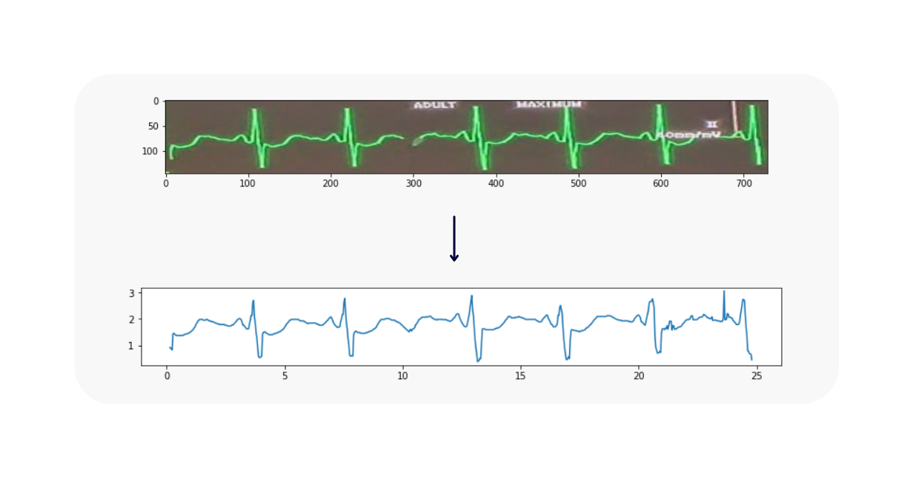</br>

<h2> Novelty </h2>

- In terms of Speed:-

    * We peformed multiprocessing during OCR recogntion for YOLO extracted bounding box vitals. We used multiprocess library of python. It boosted speed of overall recognition by 2.5X. Originally sequential OCR of each vital took around 0.4-0.5 seconds which dropped down to 0.15-0.2 sec **(Significant boost in speed)**

    * We have used Yolov5 nano for direct extraction of vitals, it is very fast on CPU as well

    * Carefully chosen input size based on the masks area in net image. We plotted histogram of both dimensions of extracted masks for finding the optimal dimension for Yolo and able to get the image size as around (384, 640) half of original size of (720, 1280). Our this variation lowered the latency while achieving same accuracy. Below presents the histogram of both dimensions of masks
    <p align="center">
    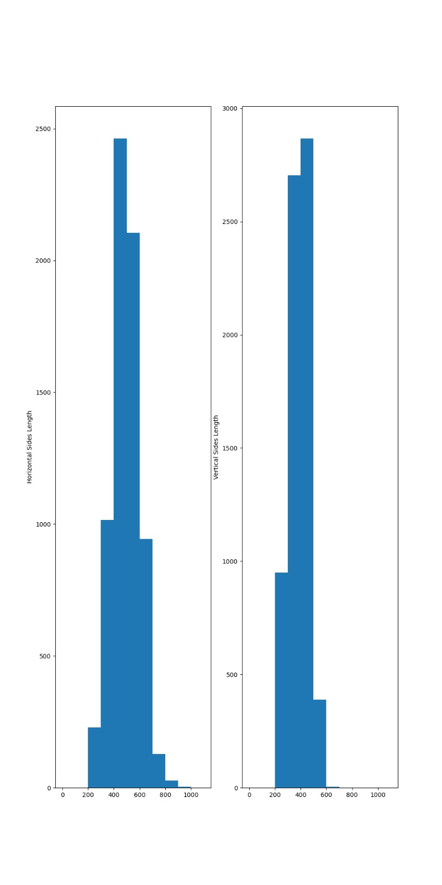
    </p>

- In terms of accuracy:-

   * We have done post-processing on the predicted results based on some montior layout info.
    For Ex - 
       1. SBP and DBP always comes together in fashion like "SBP/DBP".
       2. HR Graph and HR always are neared compared to any other graph type.
       3. Along with this we selected the highest confidence bbox vitals, if multiple predictions for a vital were found.

   * We used segmentation instead of detection for monitor extraction as most of the monitors have a quadrilateral shape instead of rectangular which motivated the use of segmentation at pixel level and we used semi-supervised based segmentation appraoch to leverage unlabelled data.

- In terms of Visualisation

   * We used Gradio visualisation to show results in good format. It is a library which runs in colab itself and provides a localhost to drop images and get results. This visualisation will help in seeing the performance and parameters clearly.

   An example of visualisation of our results is given below.

<p align="center">
    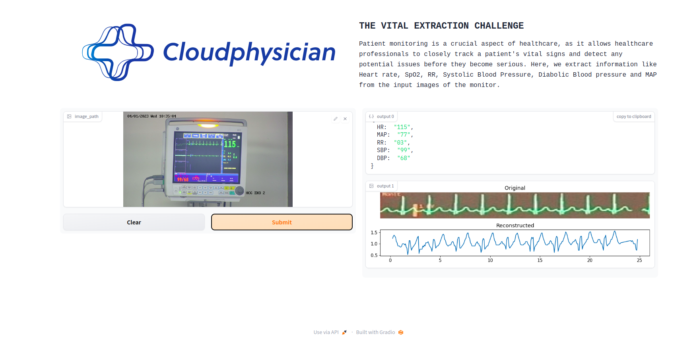
</p>

<h3> Folders Structure and Code Info</h3>

```

 - Submission.ipynb - Notebook containing inference function, along with our visualisation gradio and HR digitization scripts.
 - pipline/
    this folder contains all helper functions called in submission.ipynb
       - segmentation.py - contains segmentation inference function.
       - correct_perspective.py -  code for perspective correction
       - vitals_detector.py - YOLOv5-nano inference
       - OCR.py - inference for Paddle OCR recognition

 - notebooks/
    all train and inference codes which we used anywhere but in notebooks format.
 - assets/
    contains presentation pdf, results figures, and other pipeline images
 - yolov5nall/
    this folder contains YOLOv5 related all codes
 - weights/
    contains weights of UNET
 - Report.md - Report of our approach in .md format
 - requirements.txt - For installing all requirements.
```


